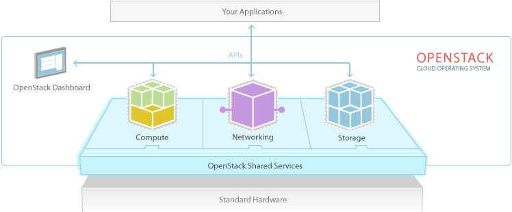
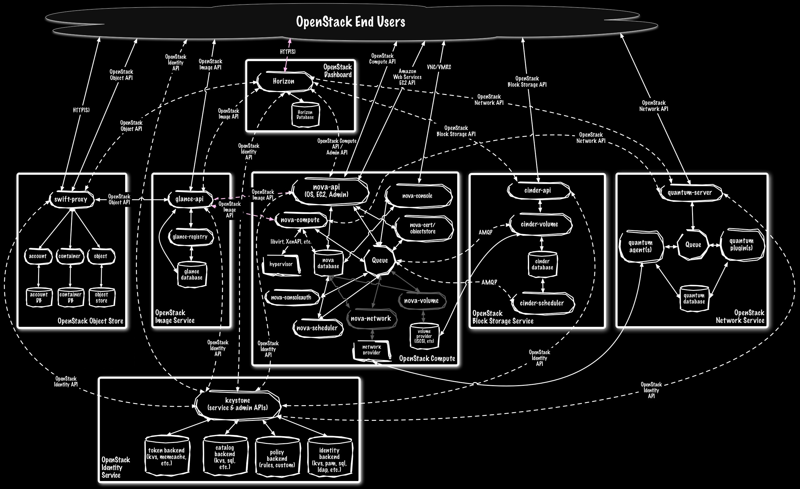
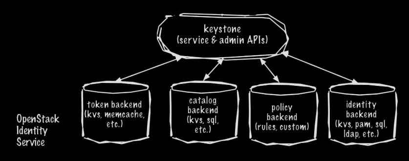
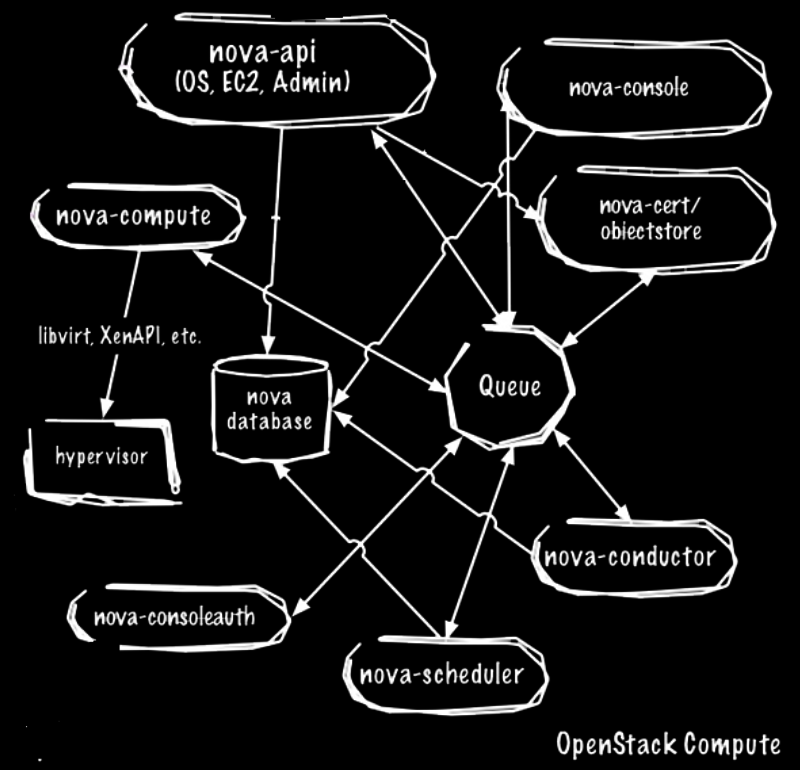
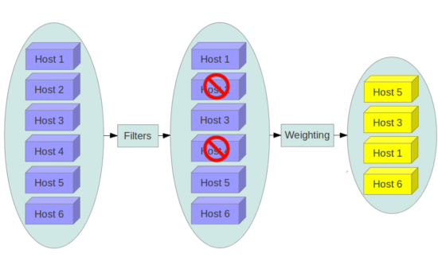
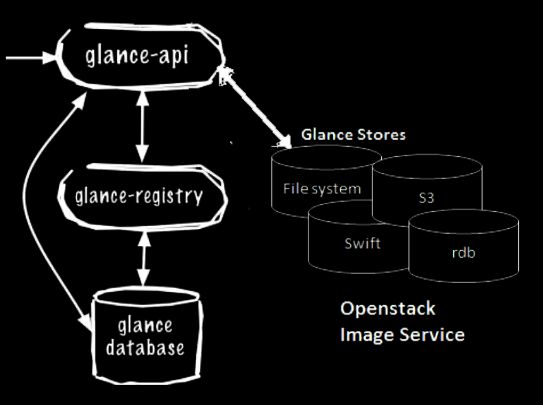
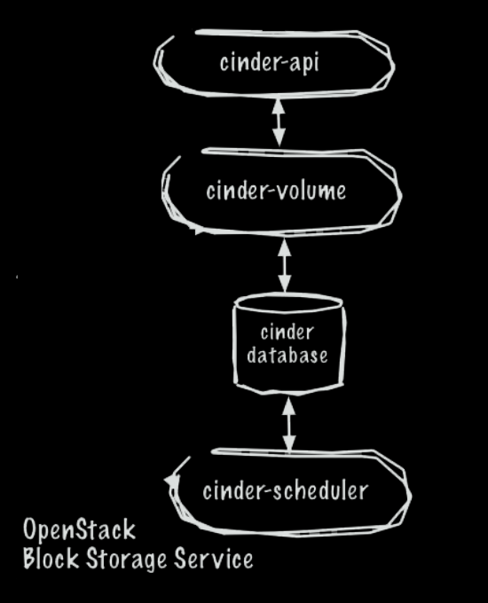
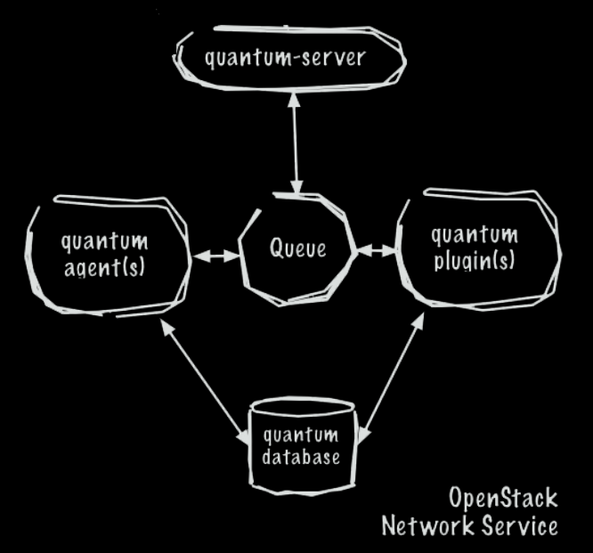
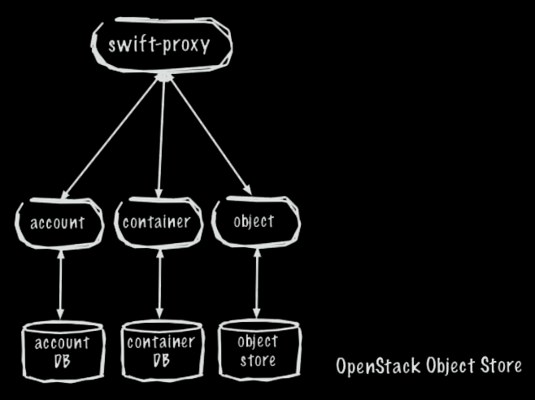

# Training 701

### Technical
Gerard Braad

gerard@unitedstack.com


## What is OpenStack


## OpenStack




## OpenStack services

  * Set of applications
    * Python


## OpenStack services

  * 'Un*x' philosophy
    * do one thing
    * and do it well

Note: microservices


## OpenStack services

  * communication


## Architecture




## OpenStack components

  * Core services
    * Identity: Keystone
    * Dashboard: Horizon
    * Compute: Nova 
    * Networking: Neutron
    * Object Storage: Swift
    * Image: Glance
    * Block Storage: Cinder

  * and many, many more ...


## Keystone

  * [Keystone](http://docs.openstack.org/developer/keystone/) provides Identity, Token, Catalog and Policy services


## Keystone Overview

  * User management  
    Tracks users and their permissions

  * Service catalog  
    Provides a catalog of available services with their API endpoints


## Keystone diagram




## Keystone overview

  * API gateway
  * Verifies access tokens
  * Entities and concepts
    * users
    * roles
    * tenants
    * ...


## Usual flow

  * authenticate with Keystone
  * obtain a _TOKEN_
  * use _TOKEN_ for transactions with OpenStack services
  * service verfies _TOKEN_ with Keystone


## Integration with LDAP

  * MySQL
    * Service catalog
  * LDAP
    * Accounts
    * Roles
    * Tenants


## Horizon

  * [Horizon](http://docs.openstack.org/developer/horizon/) is the canonical implementation of OpenStack’s Dashboard

Enables cloud administrators and users to manage various OpenStack resources and services.

It enables Web-based interactions with the OpenStack Compute cloud controller through the OpenStack APIs.


## Overview

  * Django-based
    * AngularJS
    * Bootstrap
    * jQuery
    * D3.js
    * ...
  * Extensible
    * Billing
    * Monitoring


## Customization

  * Change site title, logo and brand links
  * Modify dashboard and panel
  * Change button styles
  * Custom stylesheets
  * Custom JavaScript


## Short demonstration

  * Horizon
  * Client


## Install client

```
(.venv) $ pip install python-openstackclient
```

```
$ sudo yum install -y python-openstackclient
```

```
$ sudo apt-get install -y python-openstackclient
```

```
$ docker pull gbraad/openstack-client:alpine
```

[Info](http://github.com/gbraad/scratchpad/tree/master/technology/openstack/client.md)


## Client communication

  * RESTful API
    * HTTP Verbs/methods
    * Resource oriented
    * version-ed (microversion)
    * JSON / HTTP(S)


## Basic commands

```
$ openstack [resource] [command] [options] 
```

Note:

  * either use `source ~/.stack/dream`
  * or use `--os-cloud dream` as parameter.

[Documentation](http://docs.openstack.org/developer/python-openstackclient/)
[clouds.yaml](http://docs.openstack.org/developer/python-openstackclient/configuration.html)


## Nova

  * [Nova](http://docs.openstack.org/developer/nova/) provides power massively scalable, on demand, self service access to compute resources


## Nova diagram




## Nova overview

  * build on top of a messaging-based architecture
    * component interaction with AMQP
    * external services with REST
  * pluggable


## Nova components

  * Nova API
  * Nova scheduler
  * Nova conductor
  * Nova compute
  * Nova ConsoleAuth
  * Nova novncproxy


## Nova API

Responsible for the API for users and services
  
Example: spawning an instance from Horizon or CLI


## Nova scheduler

Using `Filters` it will dispatch requests for new virtual machines to the correct node



Nodes -> Filters -> filtered list -> Weighting -> final sorted list


## Nova compute

  * Runs on each to allow creation and termination of virtual machines.
  * Interacts with the hypervisor to launch instances
  * Instance state is maintained in the database.


## Nova services

  * Nova conductor  
    provides database access for compute nodes (reducing security risks)
  * Nova ConsoleAuth  
    handles console authentication
  * Nova novncproxy  
    provides a VNC proxy for browsers


## Nova and AMQP interaction

  * API service processes the REST requests
    * database interaction
    * RPC messaging `oslo.messaging` library


## Integration

  * Hyper-V (Windows Server, Windows 8)  
    Python application/service running on Hyper-V node
    * doesn't require clustering services
    * doesn't require shared storage
  * VMWare ESX
  * Xen
  * LXC, Docker


## Boot instance

  * Instance name
  * Flavor ID
  * Image name

  * Network ID
  * Security group
  * Keypair


## Boot instance

```
$ openstack server create test --flavor 1 --image "CentOS7" --key-name "my-key"
```

```
$ openstack server list
```


## Glance

  * [Glance](http://docs.openstack.org/developer/glance/) provides a service where users can upload and discover data assets that are meant to be used with other services


## Glance diagram




## Glance overview

  * RESTful API
    * querying image metadata
    * retrieval of image
  * storage backends
    * filesystem
    * object storage (Swift, S3)
    * Ceph RBD (distributed storage)
    * Cinder


## Glance components

  * Glance API  
    accepts calls for image discovery, retrieval, and storage
  * Glance registry
    stores, processes, and retrieves metadatda about images (size, type, etc.)
  * Glance database
    stores image metadata. MySQL or SQlite
  * Storage repository


## Supported formats

  * Disk formats
    * raw (unstructured)
    * qcow2 (qemu)
    * iso
    * vhd (Hyper-V), vmdk (VMWare), vdi (VirtualBox)
    * aki, ari, ami (AWS images)

  * Container formats
    * bare
    * ovf (Open Virtualization Format)
    * aki, ari, ami


## Glance image upload

```
$ wget -q http://cloud.centos.org/centos/7/images/CentOS-7-x86_64-GenericCloud.qcow2 -O /tmp/centos7.qcow2
$ openstack image create --disk-format qcow2 --file /tmp/centos7.qcow2 centos7
```

```
$ qemu-img convert /tmp/centos7.qcow2 /tmp/centos7.raw
$ openstack image create --disk-format raw --container-format bare --file /tmp/centos7.raw centos7
```


## Glance assets

  * Images for Nova
  * Templates for Heat
  * assets for use with other services


## Cinder

  * [Cinder](http://docs.openstack.org/developer/cinder/) provides “block storage as a service”


## Cinder overview

Originally called `Nova volume`, but is an independent project since the Folsom release. It provides infrastructure for managing volumes.


## Cinder diagram




## What is Cinder?

It virtualizes pools of block storage devices and provides users a self-service API to request and consume resources. No knowledge is required of where storage is actually deployed or on what type of device.


## Supported backends

  * Reference implementation
    * LVM, in a group named `cinder-volumes`
  * Storage appliances  
    EMC, Hitachi, IBM Storage, etc
  * Ceph, GlusterFS, Nexenta


## Volumes, snapshots and backups

  * Volumes  
    allocated block storage attached as secondary storage, or as root store to boot instances
  * Snapshots  
    read-only point in time of a volume
  * Backups  
    archived copy of a volume, stored in Object Storage


## Cinder volume creation

```
$ openstack volume create [volume-name] --size [size]
```

```
$ openstack volume create [volume-name] --image [image] --size [size]
```

```
$ openstack server add volume [server-name] [volume-name]
```


## Neutron

  * [Neutron](http://docs.openstack.org/developer/neutron/) provides “network connectivity as a service” between interface devices (e.g., vNICs)


## Neutron diagram




## Neutron overview

  * Technology agnostic
  * Extensible
  * Advanced services
    * LBaaS (Load-balancer)
    * VPNaaS (VPN)
    * FWaaS (Firewall)
  * Standalone service


## Neutron components

  * Neutron Server
  * Neutron Plugin
  * DHCP Agent
  * L3 agent
  * Advanced services
  * Neutron Database
  * ML2 (Modular layer2) plugin


## Neutron network setup

  * provider network setup
    * map into existing network (VLAN)
    * small number of tenants
    * routing with exisitng infrastructure


## Neutron network setup

  * Overlays (and L2 gateways)
    * large number of tenants
    * Floating IPs


## Neutron backends

  * Dragonflow
  * OpenContrail
  * OpenDayLight
  * OVN
  * Astara


## Demonstration

  * Security groups  
    Access rules
  * Floating IP
  * Network topology


## Swift

  * [Swift](http://docs.openstack.org/developer/swift/) is a highly available, distributed, eventually consistent object/blob store


## What is object storage

  * 'flat' structure
  * stored in containers (massive scalability)
  * metadata
  * durability
  * access via API


## What is object storage

 * Good for:
   * Media (images, music, video)
   * Documents
   * Backups
 * Not suited for:
   * Relational data
   * Data requiring updates within objects


## Swift features

  * Multi-tenancy
  * Eventual consistency (CAP)
  * Object versioning
  * Standalone


## Swift diagram




## Swift architecture

  * Account service
  * Container service
  * Object service
  * Consistency service


## OpenStack services continued

  * Astara, Barbican, Ceilometer, Cloudkitty, Designate, Freezer, Heat, Kuryr, Magnum, Manila, Mistral, Monasca, Murano, Oslo, Rally, Sahara, Searchlight, Senlin, Smaug, Solum, Tempest, Tacker, Trove, Vitrage, Watcher, Zaqar


## Ceilometer

  * Telemetry service
  * Billing, chargeback use-case
  * Cloud operator
    * Utilization


## Heat

  * Orchestration service
  * Comaptible with AWS CloudFormation
  * Uses a templating mechanism
  * Controls complex groups of cloud resources


## Heat

```
heat_template_version: 2016-04-08

description: Heat template to deploy an instance
parameters:
  ssh_key_name:
    type: string
    label: Key Pair name
    description : Name of the key pair to enable SSH access to the instance.
  flavor_name:
    type: string
    label: Flavor Name
    description: Instance type for the development environment
    default: m1.small
    constraints:
      - allowed_values: [m1.small, m1.medium]
        description: flavor_name must be one of m1.small or m1.medium
  root_password:
    label: root password
    default: secrete
    hidden: true
    description: root password for the development environment
    type: string
    constraints:
    - length: { min: 4, max: 25 }
      description: Password MUST be between 1 - 25 characters
  private_network:
    type: string
    label: Private network name or ID
    description: Network to attach instance to
    default: private
```


## Heat

```
resources:
  server:
    type: OS::Nova::Server
    properties:
      name: devenv
      flavor: { get_param: flavor_name }
      image: Fedora23
      key_name: { get_param: ssh_key_name }
      networks:
        - network: { get_param: private_network }
      user_data:
        str_replace:
          template: |
            #!/usr/bin/env bash
            # Root password
            sudo echo root:%root_password% | chpasswd
            # Installation script
            [...]
          params:
            "%root_password%": { get_param: root_password }
```


## Heat

```
  security_group:
    type: OS::Neutron::SecurityGroup
    properties:
      description: Add security group rules for the development environment
      name: devenv
      rules:
        - remote_ip_prefix: 0.0.0.0/0
          protocol: tcp
          port_range_min: 22
          port_range_max: 22

outputs:
  server_private_ip:
    description: IP address of development environment in the private network
    value: { get_attr: [ server, first_address ] }
```


## Ceilometer + Heat

Autoscaling

  * Orchestration triggered by events from telemetry data
  * Neutron with LBaaS


## Ironic

Provisions bare-metal (physical hardware) as opposed to virtual machines

  * Leverages
    * PXE
    * IPMI
    * plugin ...
  * Images can be provided by
    * HTTP
    * Cinder
    * Glance


## Deployment tools

Almost every vendor provides their own deployment tool


## Deployment approach

  * Source
    * Bleeding edge
    * Latest features and fixes are available
  * Packages  
    * At the mercy of the packagers
    * Distribution specific testing
  * Image-based  
    * Guaranteed that all nodes run the same deployment


## Devstack

A documented shell script to build a complete OpenStack development environment,
using the latest version.

[Website](http://devstack.org)

  * Ubuntu
  * Fedora
  * Debian
  * OpenSUSE

Note: for use on servers or virtual machines... and only for development purpose


## PackStack

Can do multi-node deployments, but is considered for small-scale, PoC deployments.

```
$ yum install -y centos-release-openstack-[releasename]
$ yum install -y openstack-packstack
$ packstack --allinone
```


## Conclusion

  * OpenStack provides abstractions to build a cloud infrastructure
  * It is only a part of the full deployment
    * Storage
    * Cloud Native


## Resources

  * https://gitlab.com/gbraad/openstack-handsonlabs
    * Multi-tier setup
    * Heat introduction
  * https://github.com/gbraad/scratchpad/tree/master/technology/openstack
  * https://wiki.openstack.org/wiki/Open
  * http://docs.openstack.org/mitaka/install-guide-rdo/index.html
  * http://docs.openstack.org/mitaka/config-reference/index.html
  * https://access.redhat.com/documentation/en/red-hat-openstack-platform/
  * http://wiki.openstack.org/
  * http://docs.openstack.org/ops/


## Q & A

